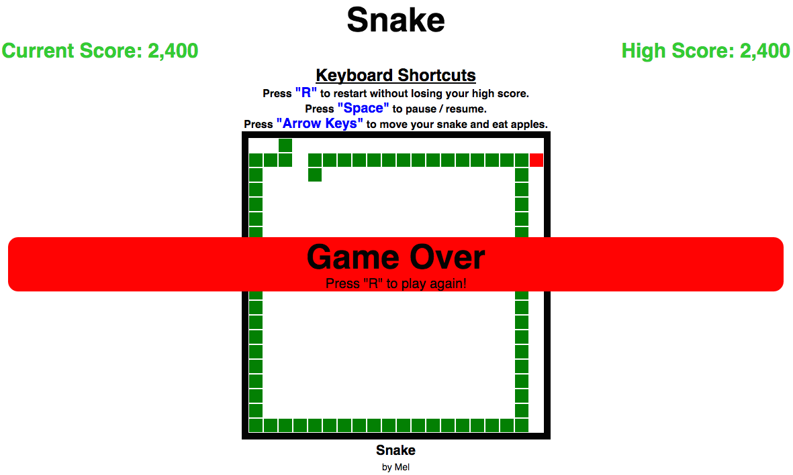

# Snake!

This is my very own version of the classic Snake game built using JavaScript.

### Highlights:
  - Implements JavaScript object oriented programming through a namespace and prototyped-based programming.
  - Utilizes jQuery to render the game's View and manipulate DOM elements.

### How To Play:
  - [Play the live version here.](http://unsaltedMixedNuts.github.io/snake)
